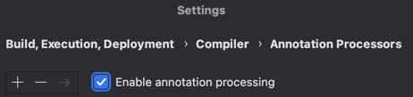

# [인프런] 스프링 MVC 1편 - 백엔드 웹 개발 핵심 기술

---

## 웹 서버 (Web Server)
HTTP 기반으로 동작

정적 리소스 제공
* HTML, CSS, JS, 이미지, 영상

## 웹 애플리케이션 서버(WAS - Web Application Server)
HTTP 기반으로 동작

웹 서버 기능 포함

애플리케이션 로직 수행 (프로그램 코드 실행)
* 동적 HTML, HTTP API
* 서블릿, JSP, 스프링 MVC

멀티스레드 지원

## 웹 시스템 구성
정적 리소스는 웹 서버가 처리하고 애플리케이션 로직은 WAS가 처리한다.

이렇게 하면 호율적인 리소스 관리가 가능하다.
* 정적 리소스가 많이 사용되면? 웹 서버 증설
* 애플리케이션 리소스가 많이 사용되면? WAS 증설

---

## 서블릿
웹 애플리케이션에서 HTTP 프로토콜을 이용해 클라이언트의 요청을 처리하고 응답을 반환하는 자바 클래스

`HttpServletRequest`(요청), `HttpServletResponse`(응답)을 통해 개발자는 HTTP 스펙을 매우 편리하게 사용할 수 있다.

## 서블릿 컨테이너
톰캣처럼 서블릿을 지원하는 WAS

서블릿 객체의 생명주기 관리 (생성, 초기화, 호출, 종료)

### 서블릿 객체의 특징
서블릿 객체는 *싱글톤*으로 관리된다.
* 요청이 올 때마다 계속 객체를 생성하는 것은 비효율적
* 최초 로딩 시점에 서블릿 객체를 만들어 두고 재활용
* 모든 요청은 동일한 서블릿 객체에 접근
* 공유 변수 사용 시 주의!
* 서블릿 컨테이너 종료 시 함께 종료

JSP도 서블릿으로 변환되어 사용

동시 요청을 위한 멀티스레드 처리 지원

---

## 멀티스레드

> **프로세스(Process)와 스레드(Thread)**
>
> 프로세스 : 운영체제로부터 자원을 할당받은 작업의 단위
>
> 스레드 : 프로세스가 할당받은 자원을 이용하는 실행 흐름의 단위

자바에서 메인 메서드를 처음 실행하면 main이라는 이름의 스레드가 실행된다. (스레드가 없으면 애플리케이션 실행 불가)

스레드는 한 번에 하나의 코드 라인만 수행한다.

동시 처리가 필요하다면 스레드를 추가로 생성한다.

### 요청마다 스레드를 생성하게 되면
장점
* 동시 요청을 처리할 수 있다.
* 리소스(CPU, 메모리)가 허용할 때까지 처리할 수 있다.
* 하나의 스레드가 지연되어도 나머지 스레드는 정상 동작한다.

단점
* 스레드는 생성 비용은 매우 비싸다.
* 고객의 요청이 올 때마다 스레드를 생성하면 응답 속도가 늦어진다.
* 스레드는 컨텍스트 스위칭 비용이 발생한다.
* 스레드 생성에 제한이 없어서 요청이 너무 많이 오면 CPU/메모리 임계점을 넘어서 서버가 죽을 수 있다.

### 이 단점을 보완하기 위한 스레드 풀(Thread Pool)
특징
* 필요한 스레드를 스레드 풀에 보관하고 관리한다.
* 스레드 풀에 생성 가능한 스레드의 최대치를 관리한다. 톰캣은 최대 200개 기본 설정 (변경 가능)

사용
* 스레드가 필요하면, 이미 생성되어 있는 스레드를 스레드 풀에서 꺼내서 사용한다.
* 사용을 종료하면 스레드 풀에 해당 스레드를 반납한다.
* 풀에 있는 스레드를 모두 사용 중이라면 기다리는 요청은 거절하거나 특정 숫자만큼만 대기하도록 설정할 수 있다.

장점
* 스레드가 미리 생성되어 있으므로 스레드를 생성하고 종료하는 비용(CPU)이 절약되고 응답 시간이 빠르다.
* 생성 가능한 스레드의 최대치가 있으므로 너무 많은 요청이 들어와도 기존 요청은 안전하게 처리할 수 있다.

**최대 스레드(Max Thread) 수를 조절하는 게 주요 튜닝 포인트이다.**

---

## 렌더링

### SSR 서버 사이드 렌더링
주로 **정적**인 화면에서 사용하며 최종 HTML 결과를 서버에서 만들어서 웹 브라우저에 전달한다.

ex) JSP, Thymeleaf

### CSR 클라이언트 사이드 렌더링
주로 **동적**인 화면에서 사용하며 자바스크립트를 이용해 HTML 결과를 웹 브라우저에서 동적으로 생성하고 적용한다.

ex) React, Vue.js

---

## Servlet 프로젝트 생성 시 주의점
https://start.spring.io/

여기서 Packaging을 War로 해 줘야 JSP를 실행할 수 있다.

## Lombok 사용 시 주의점
해당 설정에서 Enable annotation processing을 켜야 정상동작한다. (인텔리제이 기준)

---

## `@ServletComponentScan`
서블릿을 직접 등록해서 사용

`@WebServlet` : 서블릿 애노테이션

name: 서블릿 이름

urlPatterns: URL 매핑

## HTTP 요청 로그를 보고 싶을 때
`application.properties`에 `logging.level.org.apache.coyote.http11=trace` 추가 (운영서버에 이렇게 모든 요청 정보를 다 남기면 성능저하가 발생할 수 있기 때문에 개발 단계에서만 적용하는 게 좋다.)

참고! 스프링 부트 3.2 이전은 `debug`, 이후는 `trace` 적용 

---

## `HttpServletRequest`
서블릿은 HTTP 요청 메세지를 파싱하고 그 결과를 `HttpServletRequest` 객체에 담아서 제공해 준다.

이 외에도 여러 부가기능을 제공한다.

임시 저장소 기능 (해당 HTTP 요청의 시작부터 끝날 때까지 유지되는 임시 저장소 기능)
* 저장 : `request.setAttribute(name, value)`
* 조회 : `request.getAttribute(name)`

세션 관리 기능 `request.getSession(true)`
* true : 세션이 있으면 기존 세션 반환, **없으면 새로 생성**
  * `getSession()`과 `getSession(true)`은 동일하다!
* false : 세션이 있으면 기존 세션 반환, **없으면 null 반환**

---

## HTTP 요청 데이터
HTTP 요청 메시지를 통해 클라이언트에서 서버로 데이터를 전달하는 방법을 알아보자.
**주로 다음 3가지 방법을 사용한다.**
1. **GET - 쿼리 파라미터**
* /url**?username=hello&age=20**
* 메시지 바디 없이 URL의 쿼리 파라미터에 데이터를 포함해서 전달
* ex) 검색, 필터, 페이징등에서 많이 사용하는 방식

2. **POST - HTML Form**
* content-type: application/x-www-form-urlencoded
* 메시지 바디에 쿼리 파리미터 형식으로 전달 (username=hello&age=20)
* ex) 회원 가입, 상품 주문, HTML Form 사용

3. **HTTP message body**에 데이터를 직접 담아서 요청
* HTTP API에서 주로 사용 (JSON, XML, TEXT)
* 데이터 형식은 주로 JSON 사용
* POST, PUT, PATCH 사용 가능